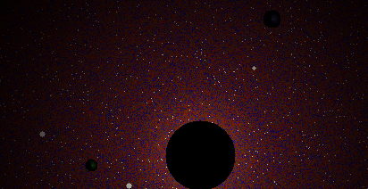
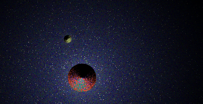
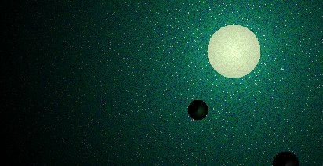
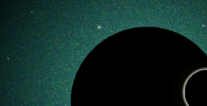

# Space Image Generator
Space image generator written in Python. This is a classic collaboration project where ChatGPT coded most of it, and I quality tested it and provided constructive feedback. No real purpose, just for fun.

## Example Images





## Installation

```bash
python3 -m venv .venv
source .venv/bin/activate
pip install -r requirements.txt
```

## Usage

```bash
python3 generate.py # generates 1 image

python3 generate.py --num 10 # generates 10 images
``````

## Contributing
Pull requests are welcome. It's awesome if you have ideas that make the images more unique and spectacular.
